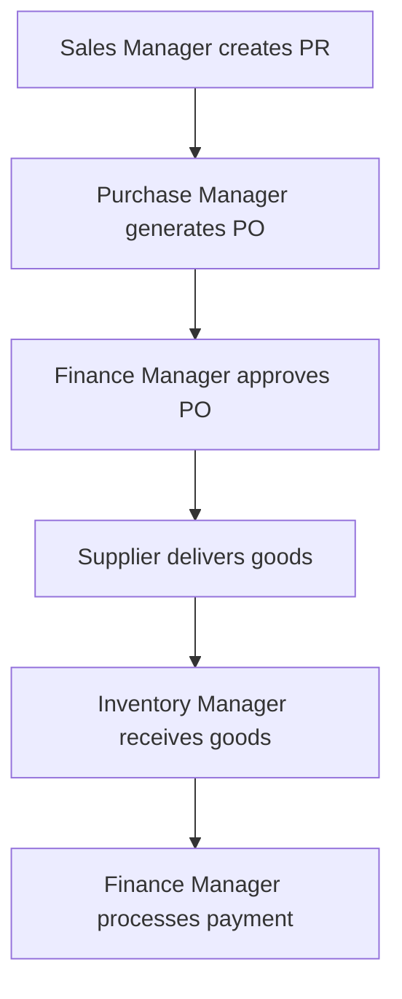

# OWSB - Purchase Order Management System

[](https://www.java.com)
[](https://docs.oracle.com/javase/tutorial/uiswing/)
[](LICENSE)
[](https://ant.apache.org/)

## Overview

OWSB (Order-Workflow-Supply-Business) is an enterprise-grade Purchase Order Management System designed for small to medium businesses. The system provides complete procurement workflow automation from purchase requisition to supplier payment processing.

## Key Features

- **Multi-Role Authentication** - Role-based access control with 5 distinct user roles
- **Complete PO Lifecycle** - End-to-end purchase order management
- **Inventory Management** - Real-time stock tracking with automated alerts
- **Financial Controls** - Approval workflows and payment processing
- **Audit Trail** - Complete transaction history and reporting
- **Data Persistence** - CSV-based storage for easy data management
- **Modern UI** - Consistent fonts, colors and button styling

## Quick Start

### Prerequisites
- Java 13+ (OpenJDK or Oracle JDK)
- Apache Ant 1.8+
- Terminal/Command Line access

### Installation & Launch
```bash
# Clone or extract the project
cd OWSB

# Start the application (recommended method)
./start-owsb.sh

# Running on a headless server
If `$DISPLAY` is not set, the startup scripts will try to use
`xvfb-run` automatically. Install the `xvfb` package first.

# Alternative: Using Ant directly
ant clean compile run
```

### Default Login Credentials
| Role | Username | Password |
|------|----------|----------|
| Administrator | `admin` | `Admin@123` |
| Sales Manager | `sales_mgr` | `Sales@123` |
| Purchase Manager | `purchase_mgr` | `Purchase@123` |
| Inventory Manager | `inventory_mgr` | `Inventory@123` |
| Finance Manager | `finance_mgr` | `Finance@123` |

## System Architecture

```
┌─────────────────┐    ┌─────────────────┐    ┌─────────────────┐
│   Presentation  │    │    Business     │    │      Data       │
│     Layer       │◄──►│     Logic       │◄──►│    Storage      │
│   (Swing UI)    │    │   (Services)    │    │   (CSV Files)   │
└─────────────────┘    └─────────────────┘    └─────────────────┘
```

## Documentation

- **[Architecture Guide](docs/architecture/)** - System design and technical architecture
- **[User Guide](docs/user-guide/)** - End-user documentation for all roles
- **[Developer Guide](docs/developer-guide/)** - Development setup and coding standards
- **[API Documentation](docs/api/)** - Service layer and integration points
- **[Deployment Guide](docs/deployment/)** - Installation and configuration

## Project Structure

```
OWSB/
├── src/                          # Source code
│   └── com/owsb/
│       ├── domain/              # Business entities
│       ├── service/             # Business logic
│       ├── ui/                  # User interface
│       └── util/                # Utilities
├── docs/                        # Documentation
├── data/                        # Runtime data storage
├── nbproject/                   # NetBeans project files
├── build.xml                    # Ant build configuration
└── user_credentials.txt         # Login reference
```

## User Roles & Capabilities

| Role | Capabilities |
|------|-------------|
| **Administrator** | User management, system configuration, all data access |
| **Sales Manager** | Item/supplier CRUD, sales entry, purchase requisitions |
| **Purchase Manager** | PO generation, vendor management, order tracking |
| **Inventory Manager** | Stock management, goods receiving, inventory reports |
| **Finance Manager** | PO approval, payment processing, financial reports |

## Business Workflow



## Technology Stack

- **Backend**: Java 13+ with service-oriented architecture
- **Frontend**: Java Swing with NetBeans GUI Builder
- **Data**: CSV file-based persistence
- **Build**: Apache Ant with automated compilation
- **Testing**: Integrated sample data for immediate use

